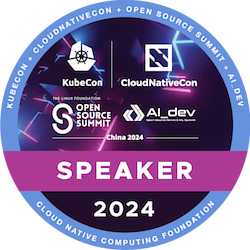
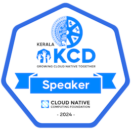

Hi! 

I'm Sreeram Venkitesh, a software engineer from Kerala, India. 

I'm an active contributor in the Kuberentes and the CNCF open source community. I've been part of the Kubernetes release team from [v1.29](https://github.com/kubernetes/sig-release/blob/master/releases/release-1.29/release-team.md), and I was the Enhancements subteam lead for [v1.31](https://github.com/kubernetes/sig-release/blob/master/releases/release-1.31/release-team.md) and a release lead shadow for the [v1.32](https://github.com/kubernetes/sig-release/blob/master/releases/release-1.29/release-team.md) cycle. I've been helping to write and publish the [Last Week in Kubernetes Development newsletter](https://lwkd.info) for over two years now.  I also [host a meeting](https://github.com/kubernetes/website/?tab=readme-ov-file#new-contributor-ambassadors) on the first Tuesday of every month to help new folks make their first contribution to the Kubernetes documentation. I've also contributed a couple small features to Kubernetes. In v1.32, I shipped a feature to [enable zero duration for the Pod lifecycle hooks' sleep action](https://github.com/kubernetes/enhancements/issues/4818). See all of my contributions to Kubernetes [here](https://sreeram.xyz/k8s).

Currently I'm working at DigitalOcean as part of the storage team. Previously I worked at [BigBinary](https://bigbinary.com) where I helped build [NeetoDeploy](https://neetodeploy.com), a cloud deployment Platform as a Service on top of Kubernetes. I've been working at BigBinary since 2021 after I finished university and did various infrastructure and ops related work for three and a half years there.

I love giving [technical talks](https://sreeram.xyz/talks) at conferences. I find the entire process of researching and preparing a talk one of the best ways to learn about a topic in detail. I enjoy writing blogs about the things I'm learning as well. You can read more about my work and my blogs in my [personal website](https://sreeram.xyz).
  
<!-- 

 -->

<!-- <table>
  <tr>
    <td>
        
    </td>
    <td>
        
    </td>
  </tr>
<!--     <tr>
        <td colspan="2">
        
        </td>
    </tr> -->
</table>
<!-- 

 
    
<!--  

<a href="https://twitter.com/fillerInk" target="_blank">
  

 -->

